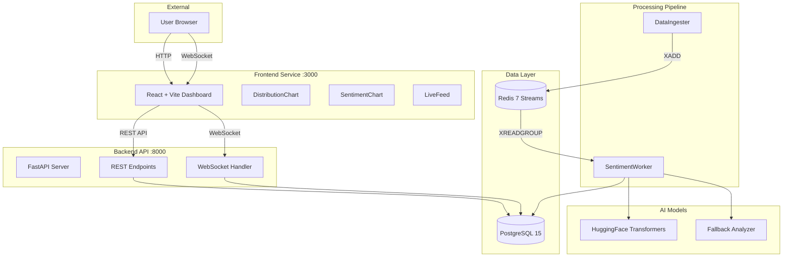

# System Architecture

This document describes the technical architecture of the Real-Time Sentiment Analysis Platform.

## System Overview

The platform processes social media content through a distributed pipeline: ingestion → analysis → storage → visualization. Each stage runs as an independent containerized service, communicating via Redis Streams and PostgreSQL.



## Data Flow

1. **Ingestion** — DataIngester generates posts and publishes to Redis Stream via `XADD`
2. **Processing** — Worker reads messages with `XREADGROUP`, runs analysis, persists results, acknowledges with `XACK`
3. **Storage** — PostgreSQL stores posts, analysis results, and alerts
4. **Serving** — FastAPI reads from PostgreSQL for REST responses
5. **Real-time** — WebSocket broadcasts metrics every 30 seconds

## Services

### DataIngester

Generates synthetic social media posts at a configurable rate.

**Location:** `ingester/ingester.py`

```python
class DataIngester:
    def __init__(self, redis_client, posts_per_minute=10)
    def generate_post(self) -> dict
    async def publish_post(self, post) -> bool
    async def start()
```

Output format:
```json
{
  "post_id": "uuid",
  "platform": "twitter|reddit|tiktok|instagram",
  "content": "...",
  "author": "@username",
  "created_at": "ISO8601"
}
```

### SentimentAnalyzer

Runs dual-model classification: sentiment (positive/negative/neutral) and emotion (joy/anger/sadness/fear/surprise/neutral).

**Location:** `backend/services/sentiment_analyzer.py`

```python
class SentimentAnalyzer:
    def __init__(self, model_type='local', model_name=None)
    async def analyze_sentiment(self, text) -> dict
    async def analyze_emotion(self, text) -> dict
    async def batch_analyze(self, texts) -> list
```

Uses HuggingFace `distilbert-base-uncased-finetuned-sst-2-english` for sentiment and `j-hartmann/emotion-english-distilroberta-base` for emotion. Falls back to keyword-based heuristics if models fail.

### SentimentWorker

Consumes from Redis Stream using consumer groups. Handles message acknowledgment with `XACK` and supports batch processing.

**Location:** `worker/worker.py`

```python
class SentimentWorker:
    def __init__(self, redis_client, db_session_maker, stream_name, consumer_group)
    async def process_message(self, message_id, message_data) -> bool
    async def run(self, batch_size=10, block_ms=5000)
```

Features:
- Consumer group semantics for exactly-once processing
- Automatic retry on transient failures
- Concurrent sentiment + emotion analysis

### AlertService

Monitors sentiment distribution and triggers alerts when thresholds are exceeded (e.g., >60% negative in the last hour).

**Location:** `backend/services/alerting.py`

```python
class AlertService:
    def __init__(self, db_session_maker, redis_client=None)
    async def check_thresholds(self) -> dict | None
    async def save_alert(self, alert_data) -> int
    async def run_monitoring_loop(self, check_interval_seconds=60)
```

## Database Schema

### social_media_posts

| Column | Type | Notes |
|--------|------|-------|
| id | Integer | Primary key |
| post_id | String(255) | Unique, indexed |
| platform | String(50) | Indexed |
| content | Text | Required |
| author | String(255) | |
| created_at | DateTime | Indexed |
| ingested_at | DateTime | Default: now() |

### sentiment_analysis

| Column | Type | Notes |
|--------|------|-------|
| id | Integer | Primary key |
| post_id | String(255) | FK → social_media_posts.post_id |
| model_name | String(100) | Required |
| sentiment_label | String(20) | Indexed |
| confidence_score | Float | 0.0 - 1.0 |
| emotion | String(50) | Nullable |
| analyzed_at | DateTime | Indexed |

### sentiment_alerts

| Column | Type | Notes |
|--------|------|-------|
| id | Integer | Primary key |
| alert_type | String(50) | e.g., "high_negative" |
| threshold_value | Float | Configured threshold |
| actual_value | Float | Observed value |
| window_start | DateTime | Analysis window |
| window_end | DateTime | |
| post_count | Integer | Sample size |
| triggered_at | DateTime | Indexed |
| details | JSON | Additional context |

## API Endpoints

### REST

| Endpoint | Method | Response |
|----------|--------|----------|
| `/api/health` | GET | `{status, timestamp, services, stats}` |
| `/api/posts` | GET | `{posts, total, limit, offset}` |
| `/api/analytics` | GET | `{positive_count, negative_count, neutral_count, total_count, percentages, distribution}` |

Query parameters for `/api/posts`:
- `limit` — Max results (default: 50, max: 100)
- `offset` — Pagination offset
- `platform` — Filter by platform
- `sentiment` — Filter by sentiment label

### WebSocket

**Endpoint:** `ws://localhost:8000/ws/sentiment`

| Event | Payload |
|-------|---------|
| `connected` | `{type: "connected", message: "..."}` |
| `new_post` | `{type: "new_post", data: {...}}` |
| `metrics_update` | `{type: "metrics_update", data: {...}}` |

Metrics broadcast every 30 seconds.

## Technology Choices

| Component | Technology | Rationale |
|-----------|------------|-----------|
| API | FastAPI | Native async, WebSocket support, auto-generated OpenAPI docs |
| Database | PostgreSQL 15 | ACID compliance, JSON columns, mature ecosystem |
| Queue | Redis Streams | At-least-once delivery, consumer groups, persistence |
| AI | HuggingFace | Pre-trained models, easy deployment, active community |
| Frontend | React + Vite | Fast HMR, component model, large ecosystem |
| Charts | Recharts | Declarative API, React-native, responsive |

## Configuration

All configuration via environment variables:

| Variable | Description |
|----------|-------------|
| `DATABASE_URL` | PostgreSQL connection string |
| `REDIS_HOST`, `REDIS_PORT` | Redis connection |
| `REDIS_STREAM_NAME` | Stream name for posts |
| `REDIS_CONSUMER_GROUP` | Consumer group name |
| `HUGGINGFACE_MODEL` | Sentiment model |
| `EMOTION_MODEL` | Emotion model |

See `.env.example` for all options.

## Scaling Considerations

- **Workers** — Add more worker containers to increase throughput
- **Database** — Connection pooling via SQLAlchemy async
- **Redis** — Consumer groups distribute load across workers
- **Frontend** — Static assets, can be CDN-deployed

Current configuration handles ~600 posts/minute on a 4-core machine.
